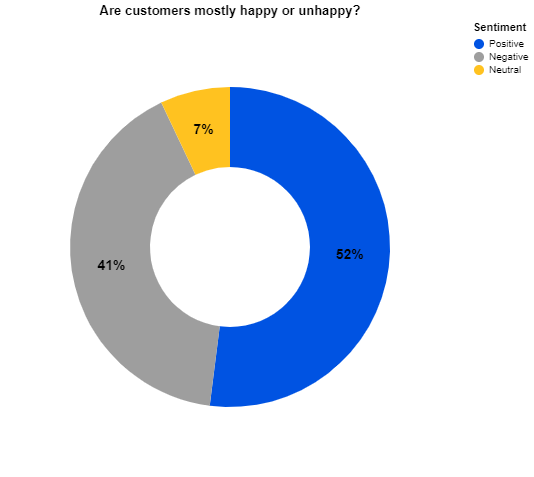
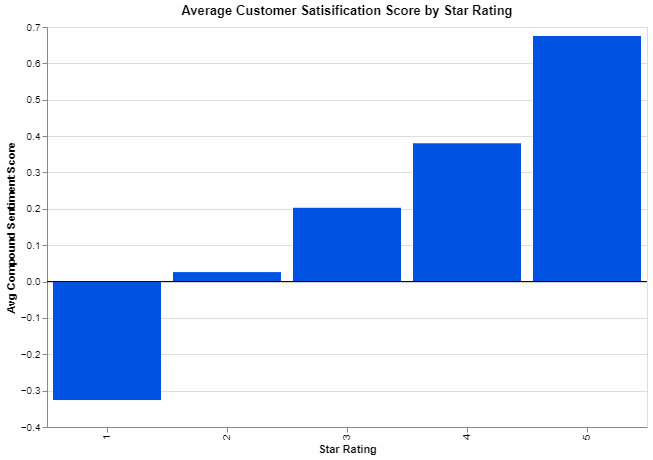
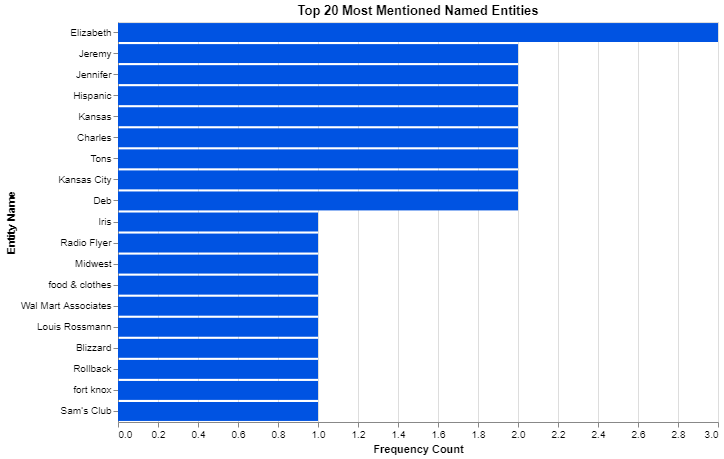
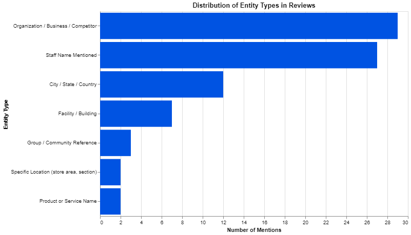
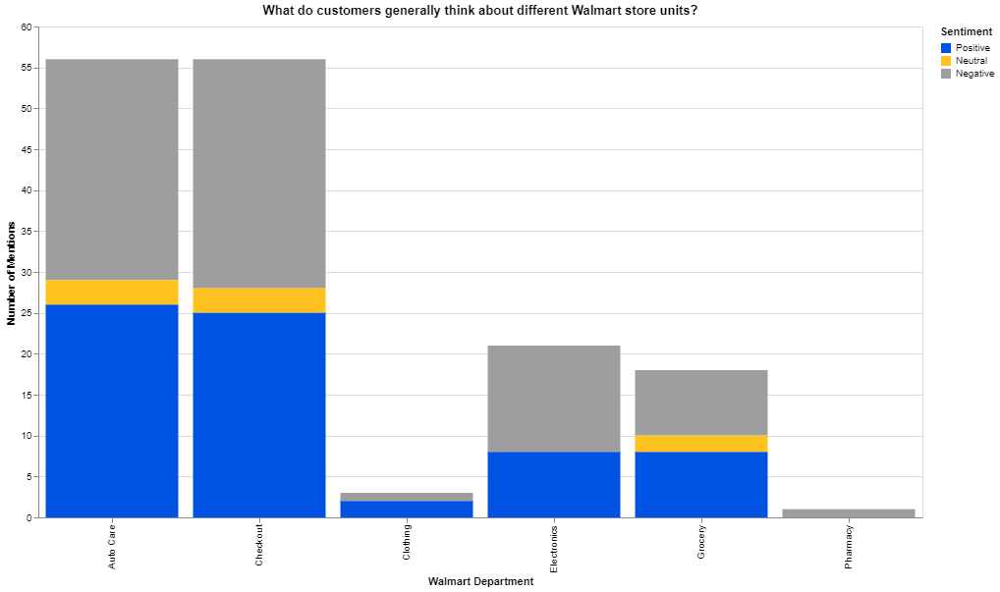
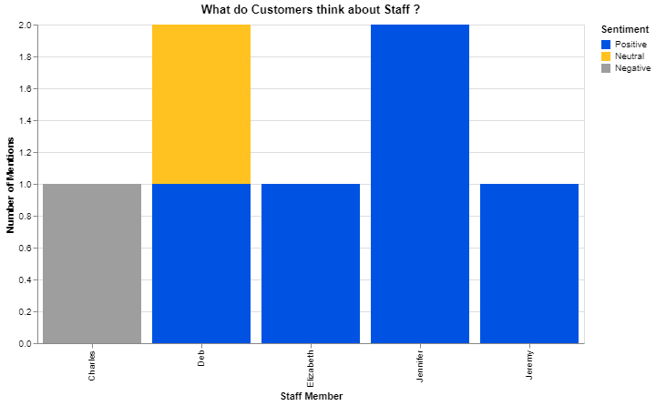
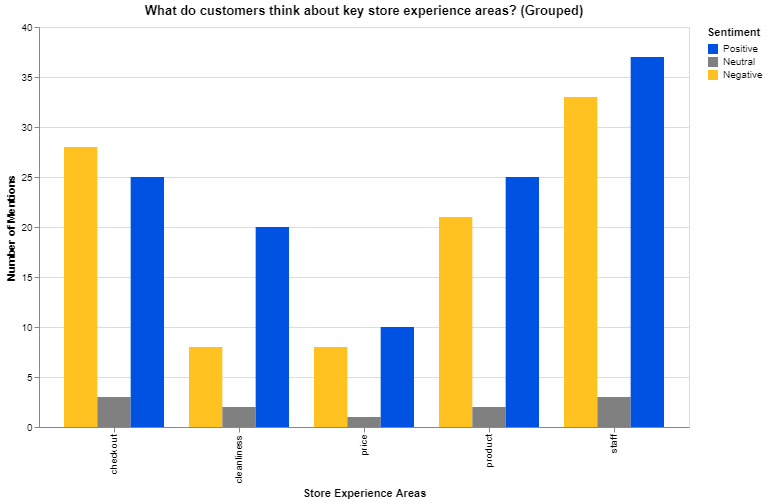
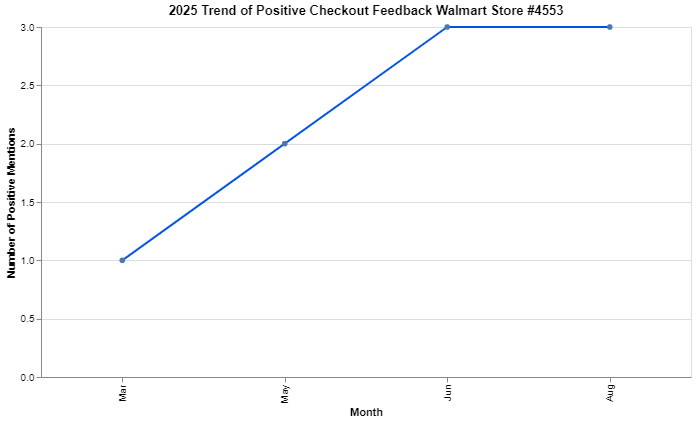
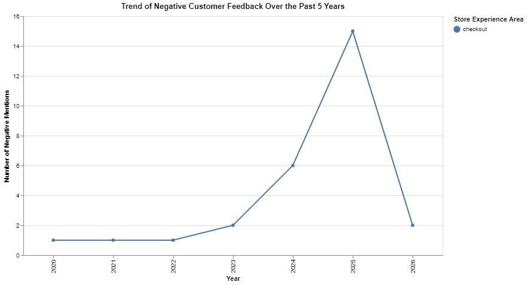
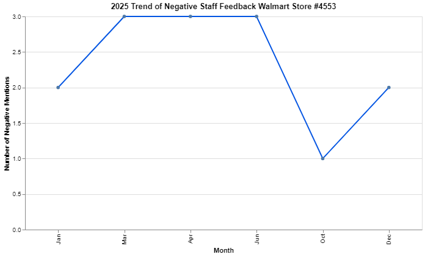

# 🛒 Walmart Customer Experience Analysis
### Turning Customer Reviews into Actionable Insights


---

> **Disclaimer:** This project is a conceptual and educational representation created for business analysis and portfolio purposes. It does not represent the official or proprietary process of Walmart. The model is based on publicly available information, logical workflow structuring, and standard analytical practices.

---

## 📌 Project Overview

This project analyzes customer reviews from **Walmart Store #4553 (Kansas City, MO)** to understand how customers feel about their shopping experience.

Using Python and text analytics, I transformed unstructured review data into clear insights that help improve operations, staff performance, and customer satisfaction.


---

## 🎯 Key Questions Answered

- What do customers generally think about their experience?
- Which store areas receive the most feedback?
- Are customers more positive or negative in specific areas?
- Which staff members are mentioned and why?
- How has customer sentiment changed over time?

---

## 🧠 Approach

1. Data Collection (SerpAPI)
2. Data Cleaning (NLP preprocessing)
3. Word Frequency Analysis
4. Named Entity Recognition (spaCy)
5. Sentiment Analysis (VADER)
6. Aspect-Based Sentiment Analysis
7. Trend Analysis
8. Staff-Level Insights

---

## 📊 Key Visualizations

### Overall Customer Sentiment


### Sentiment by Star Rating


### Top 20 Named Entities (Type Distribution)


### Top 20 Most Mentioned Named Entities


### What Customers Think About Store Departments


### What Customers Think About Staff


### Store Experience Aspect Sentiment


### 2025 Trend – Positive Checkout Feedback


### 5-Year Trend – Negative Checkout Feedback


### 2025 Trend – Negative Staff Feedback


---

## 📊 Key Insights

- Customers are **generally positive (52%)**, but issues are concentrated
- **Checkout and Auto Care** show the most negative feedback
- **Staff interactions** strongly influence customer satisfaction
- Feedback clearly highlights operational problem areas

---

## 💡 Real-World Impact

- Identify operational issues quickly
- Improve checkout efficiency
- Recognize high-performing staff
- Monitor trends over time

---

## ⚠️ Limitations

- Limited dataset (Google reviews only)
- VADER may miss sarcasm
- Keyword-based aspect classification
- Single store focus

---

## 🛠️ Tools & Technologies

- **Python** (pandas, NumPy)
- **NLP:** NLTK, spaCy
- **Sentiment Analysis:** VADER
- **Visualization:** Matplotlib, Seaborn, Altair
- **API:** SerpAPI

---

## 🚀 How to Run

```bash
pip install -r requirements.txt
jupyter notebook notebook.ipynb
```

---

## 📁 Project Structure

```
Walmart-cx-analysis/
├── README.md
├── requirements.txt
├── notebook.ipynb
├── data/
│   ├── reviews.csv
│   ├── reviews_with_sentiment.csv
│   └── name_entities.csv
├── images/
│   └── (all chart images)
└── docs/
    └── project_summary.md
```

---

## 👤 Author

**Steve O** | [@Steve0a](https://github.com/Steve0a)  
Data Analyst | Business Intelligence | NLP Enthusiast  
📍 Kansas City, MO
